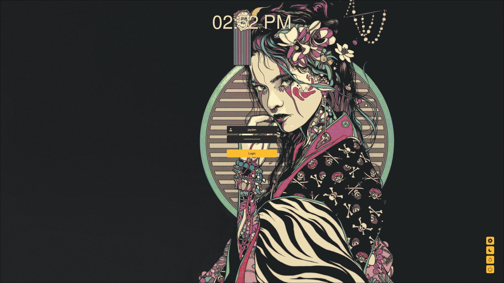

<div align="center">
  <h3>SDDM</h3>
  <p>Gruvbox theme for SDDM</p>
</div>

<p align="center">
  
</p>


## Usage
1. Download your preferred theme variant from the [releases page](https://github.com/hman278/sddm-gruvbox/releases).
2. Extract the downloaded archive into the following directory:  
   `/usr/share/sddm/themes/`
3. Open the SDDM configuration file located at `/etc/sddm.conf`. Set the theme by adding or modifying the following lines:

   ```
   [Theme]
   Current=sddm-gruvbox
   ```


   > If `/etc/sddm.conf` doesn’t exist, you can create it manually. Just ensure it has the `.conf` extension and includes the lines above.


## Credits

This project is based on the [Catppuccin SDDM theme](https://github.com/catppuccin/sddm).


### License
This project is licensed under [MIT License](https://github.com/he1senbrg/sddm-gruvbox/blob/main/LICENSE).


Original work Copyright (c) [2025] [he1senbrg](https://github.com/he1senbrg)  
Modified work Copyright (c) [2025] [hman278](https://github.com/hman278)
